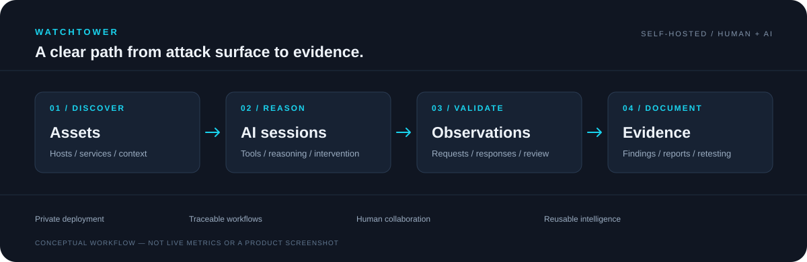

<div align="center">


# 瞭望塔 Watchtower

**从攻击面，到真实证据。**

面向授权安全评估的 AI 自主渗透与资产情报平台。

Self-hosted AI security assessment, asset intelligence, and evidence workflows.

**开发起始日期：2026年6月3日**

**[中文](README.md) · [English](README.en.md)**

[](LICENSE)
[](requirements.txt)
[](frontend/package.json)
[](docs/installation.md)

[官方网站](https://watchtowers.info/) · [快速部署](docs/installation.md) · [开发指南](docs/development.md) · [架构说明](docs/architecture.md) · [版本发布](https://github.com/LINGYK352/Watchtower/releases) · [问题反馈](https://github.com/LINGYK352/Watchtower/issues)

</div>



## 项目介绍

Watchtower 将资产侦察、AI 工具调用、人工介入和证据整理连接在同一个工作台中。你可以从目标资产创建任务，观察会话执行过程，管理漏洞线索与验证记录，并形成报告。

项目由个人开发者维护，免费开放源码，采用 **GPL-3.0-only**。软件可以自行部署；模型调用和外部数据源可能需要使用者自行配置账号或承担费用。

> `main` 展示正式源码，当前为 **v1.21.165**，与官网当前正式版本一致。测试迭代不直接进入主分支；当前源码版本见 [version.txt](version.txt)，安装包及后续正式版本以[官网](https://watchtowers.info/)为准。

## 主要能力

| 能力 | 在平台中完成的工作 |
| --- | --- |
| **资产与攻击面** | 管理域名、IP、站点、服务和指纹，按任务或资产分组组织侦察结果 |
| **AI 渗透会话** | 配置模型 Provider，结合资产上下文调用工具，查看执行轨迹与会话状态 |
| **人工协作** | 通过 AI 控制台介入、接管和继续会话，保留关联记录 |
| **漏洞与报告** | 区分待验证线索与已关联验证证据的结果，整理复现信息和报告 |
| **情报关联** | 查询组件漏洞、方法论和历史线索，关联资产、系统与攻击链信息 |
| **工具与扩展** | 管理工具配置和扩展包，经适配器接入独立工具与平台能力 |
| **运行管理** | 配置代理出口、计划任务与并发资源，查看访问、执行和系统日志 |

Web/API 是主要工作场景；App、小程序和探针相关模块依赖相应运行环境、外部组件及明确授权。具体能力以实际版本和配置为准。

## 快速部署

预构建安装包面向 **Linux x86_64**，由 Docker Compose 运行平台及配套服务。

```bash
# 下载官方安装脚本，检查内容后执行
curl -fL https://watchtowers.info/dist/install.sh -o install.sh
sudo bash install.sh
```

按交互菜单选择安装方式。已有部署应先备份配置与数据库；**全新安装和卸载会删除已有数据，不能当作普通更新使用**。

安装后按终端提示访问平台，通常为 `http://<服务器地址>:5555`。首次登录后修改默认凭据，再配置模型和所需数据源。正式使用前确认目标授权、网络出口及数据处理边界。

**[完整部署说明 →](docs/installation.md)**

## 一次评估如何推进

1. **明确目标**：确定允许测试的资产、账号、时段和操作范围。
2. **建立上下文**：创建侦察任务或录入资产，关联站点、服务及组件信息。
3. **启动会话**：选择模型和任务配置，观察 AI 调用工具的过程，必要时人工介入。
4. **检查证据**：核对真实请求、响应和复现条件，区分线索、验证状态和危害等级。
5. **整理结果**：归集发现、处理状态与报告，为修复和复测提供依据。

上方配图为工作流程示意，不展示真实客户数据，也不代表性能测试结果。AI 输出和自动判定仍需要结合实际证据审查。

## 架构与技术栈

| 层级 | 技术与职责 |
| --- | --- |
| 前端 | Vue 3、TypeScript、Vite、Ant Design Vue |
| API | Python、Flask、Flask-RESTX、Gunicorn |
| 任务执行 | Celery、RabbitMQ、独立 Scheduler |
| 数据 | MongoDB、实例持久化目录 |
| 部署 | Docker Compose、Nginx、Mihomo 代理服务 |
| 工具接入 | 独立进程适配器、浏览器工具和扩展运行时 |

```text
Watchtower/
├── sentinel_platform/    后端、接口、业务模块与测试
│   ├── core/             配置、数据访问与基础能力
│   ├── contracts/        服务契约、Registry 与集合定义
│   ├── router/           HTTP API、鉴权与响应封装
│   └── modules/          资产、任务、AI 会话、情报与系统管理
├── frontend/             前端源码与公共品牌素材
├── docker/               安装脚本、镜像构建与编排配置
├── config/               不含实际凭据的配置样例
├── dicts/                运行时字典与模板
├── docs/                 公开项目文档
└── .github/              Issue 与 Pull Request 模板
```

仓库不包含开发者运行密钥、真实配置、数据库、会话数据、内部运维资料，以及完整的外部二进制和离线依赖包。**克隆源码不等于获得可以直接离线构建的完整发行包**；详情见[开发指南](docs/development.md)。

## 文档导航

| 我想做什么 | 从这里开始 |
| --- | --- |
| 安装和使用 | [部署与更新说明](docs/installation.md) |
| 下载正式版源码和查看发布说明 | [Releases](https://github.com/LINGYK352/Watchtower/releases) |
| 了解模块与调用关系 | [架构说明](docs/architecture.md) |
| 在本地开发和检查改动 | [开发指南](docs/development.md) |
| 提交代码或功能建议 | [贡献指南](CONTRIBUTING.md) |
| 报告平台安全问题 | [安全政策](SECURITY.md) |
| 了解许可证与外部组件边界 | [GPL-3.0](LICENSE) · [第三方组件说明](THIRD_PARTY_NOTICES.md) |
| 查看历史迭代 | [更新日志](CHANGELOG.md) |

## 贡献与反馈

欢迎通过 [Issues](https://github.com/LINGYK352/Watchtower/issues) 提交可复现的问题或功能建议，通过 Pull Request 参与改进。提交前请阅读[贡献指南](CONTRIBUTING.md)。

涉及平台漏洞、凭据泄露或真实目标数据的问题，请通过 [SECURITY.md](SECURITY.md) 中的私下渠道联系，不要直接发布到公开 Issue。

## 许可证与使用边界

本项目原创代码按 [GNU General Public License v3.0 only](LICENSE) 提供，SPDX 标识为 `GPL-3.0-only`。第三方代码、工具、数据和素材保留各自声明及许可证；本项目许可证不重新授权这些内容。软件按适用许可条款提供，法律规定不能免除的责任不受排除。

仅在依法拥有权限或获得有效授权的环境中开展测试。下载、注册、激活或选择某种运行模式，均不构成对第三方系统的测试授权。模型及外部服务可能接收发送给它们的数据，请自行核对服务条款、保密和数据处理要求。

---

<div align="center">

由 **LINGYK** 维护 · [watchtowers.info](https://watchtowers.info/) · [联系开发者](mailto:lingyangkang352@163.com)

</div>
