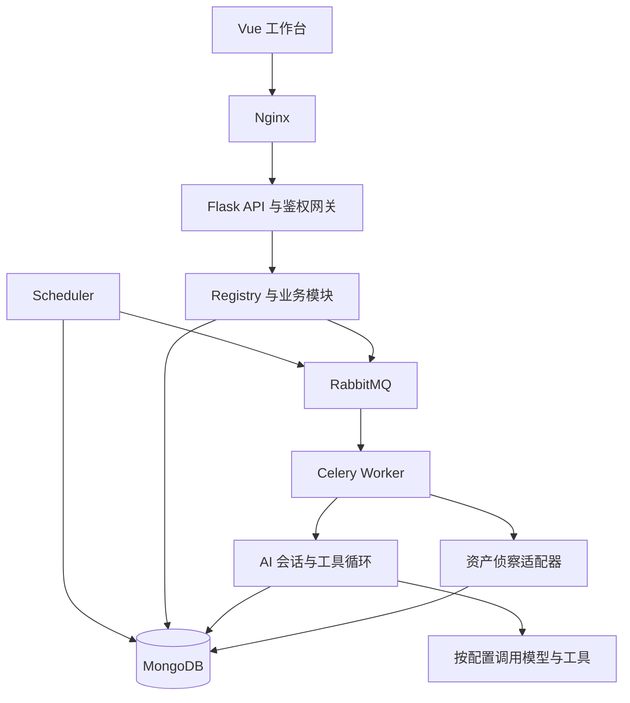

# 架构说明

Watchtower 的主流程是资产侦察、情报归集、会话派发、工具调用和结果整理。Web、Worker 与 Scheduler 共享模块装配和数据契约，承担不同的运行职责。

## 主要代码入口

| 入口 | 职责 |
| --- | --- |
| `sentinel_platform/bootstrap.py` | 注册模块能力并维护索引装配 |
| `sentinel_platform/wsgi.py` | Gunicorn Web 入口及任务投递装配 |
| `sentinel_platform/celery_app.py` | 异步任务消费入口 |
| `sentinel_platform/scheduler.py` | 任务调度、状态恢复、计划任务及周期检查 |
| `modules/kernel/orchestration.py` | 任务编排、认领、停止和后续派发 |
| `modules/kernel/recon/` | 侦察流水线及外部工具适配 |
| `modules/ai_pentest/session.py` | 会话创建、状态管理与派发接口 |
| `modules/ai_pentest/_engine.py` | 模型调用、工具循环、检查点和收尾 |
| `modules/risk_intel/vuln_center.py` | 发现记录、证据关联、统计与展示数据 |
| `frontend/src/api/request.ts` | 前端请求、Token 与响应处理 |

表中 `modules/` 均位于 `sentinel_platform/` 下，保持现有包名与目录布局。

## 服务边界

主平台 Compose 包含 Web、Worker、Scheduler、MongoDB、RabbitMQ、Mihomo 和 Nginx。模型 Provider 由使用者配置；是否向外发送内容取决于实际模型与工具调用，不应把私有部署理解为绝不外发数据。

官方分发、注册和更新服务是独立系统。它向部署实例提供对应服务，不属于用户主平台 Compose 栈；运营方内部脚本及注册库不随本仓库发布。

171守门员为热更新提供跨进程锁、持久事务、固定目标和逐级运行确认。172起，构建端预制公共＋平台专属变更ZIP及相邻逆向包，分发端只校验、存储和下载。Web/Windows源码与运行通道独立、版本同步，注册激活账户共用；Windows暂未公开分发。见[更新链路契约](update-delivery.md)，其中列出当前早于171的回退限制。

## 扩展与外部依赖

`external/` 在完整部署环境中存放外部二进制或独立项目，`vendor/` 保存离线依赖。适配器负责构造调用、管理进程、解析结果并返回平台认识的数据结构。

扩展包通过清单描述工具参数及运行方式，由扩展运行时执行。源码仓库中的适配器不等于附带了所有外部工具；许可证与发行包依赖清单仍需分别核对。

内置报告模板的分发原件位于 `dicts/report_templates/`。根目录 `template/` 是运行时输出位置，包含复制的内置模板、用户上传文件和生成报告，不纳入源码仓库。内置模板运行产物缺失时，已有播种逻辑会从分发原件重建。

## 状态与证据

自动会话和人工控制台会话存在不同的恢复及调度路径；修改恢复逻辑时应避免重复认领、与人工回合并发执行等问题。

发现记录区分证据状态与危害等级。证据关联是辅助判断，不能将成功状态码、工具执行成功或模型自述直接等同于漏洞成立；结果需要结合身份、前置条件、真实观测及复现过程核验。

## 文档依据

本说明按当前公开源码和 Compose 文件整理。内部历史文档可能使用旧包名、端口或进程布局；开发时应结合当前实现及测试核实具体行为，而不是机械套用历史说明。

## 资源与队列优化（v1.21.167）

保留 3×8 Web 线程布局与 4 个 Celery 执行进程。大任务优先引用 MongoDB 中相同的已持久化参数，小任务及显式覆盖保留内联；数据库读取失败时不以空参数执行。资源池每轮 CAS 冲突与抢占后重新读物理内存，账本依然从 MongoDB fresh 读。新旧设计、数据库读取代价、真实测量及回滚见 [资源架构测试](resource-architecture.md)。该变更经 167-5 VM 测试后纳入获批的 Web 正式版本 167。工具调用的回填和存量历史恢复见 [消息恢复契约](tool-message-recovery.md)。
